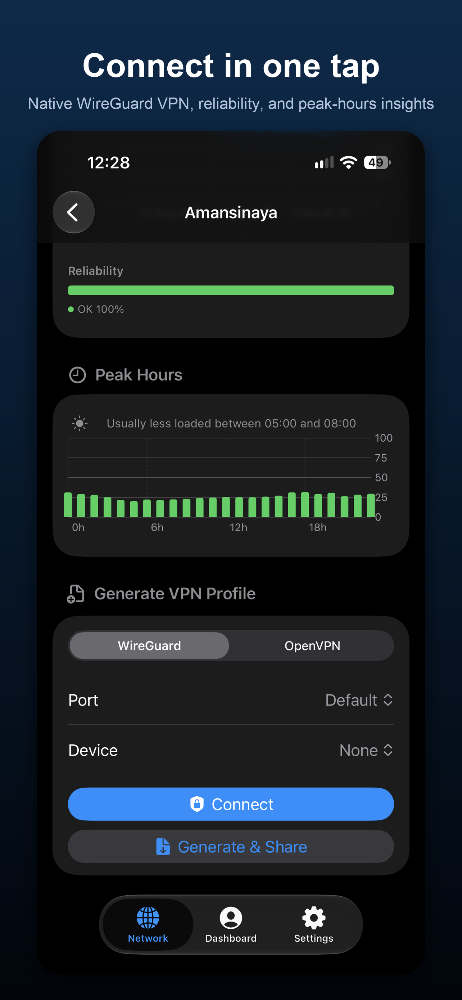

# AirDash


[](https://github.com/zlimteck/AirDash/actions/workflows/build.yml)

Unofficial native iOS dashboard for [AirVPN](https://airvpn.org), built with SwiftUI and the iOS 26 Liquid Glass design.

> ⭐ If you find this project useful, a star on GitHub is greatly appreciated!

> **Disclaimer**: this is an independent project with no affiliation to AirVPN. It uses the public AirVPN API with your personal API key.

---

## Screenshots

<p float="left">
  
  
  
  
  
</p>

---

## Features

- **Network**: full server list with load, users, health, ping latency, sort (load / name / ping), continent filter, search and favorites (scoped per account)
- **Best Server**: automatically picked from live ping and load, weighted so a congested server can't win purely on a low ping; instantly shows the previous session's result while the fresh ping sweep is running
- **Server history & trends** (opt-in, off by default): load and connected-users charts per server over 1h/24h/7d/30d, a reliability breakdown (healthy vs warning/error) also surfaced as a badge on favorite servers and in Trends, a peak-hours chart highlighting the quietest 3-hour window from 7 days of history, and a Trends screen ranking servers by average load over a rolling window; all powered by a companion history service, not the official AirVPN API. Enable it in Settings; see [Privacy Policy](PRIVACY.md) for exactly what that service sees
- **Server comparison**: long-press any server to add it to a comparison (up to 3); tap the toolbar button to view them side by side, including bandwidth and (if the history feature above is enabled) an overlaid load-history chart across the compared servers
- **Native VPN (WireGuard)**: connect and disconnect straight from the app via `NetworkExtension`, no external VPN app required; live tunnel status card on the Dashboard with swipe to disconnect, one profile saved and reused (regenerated only on explicit action). Only available in the full build; see [Full vs Lite build](#full-vs-lite-build) below
- **Dashboard**: account info (current IP, VPN status, expiration, credits, sessions, member since); swipe left on a session to disconnect (also stops the native tunnel if it's this device's own session), tap a session to jump to its server detail
- **Server detail**: WireGuard or OpenVPN profile generation, direct import into the system VPN app, share and QR code (WireGuard) in a `···` menu; a direct **Connect** button for WireGuard (native build only), skipping the generate/share step; recent profiles per server with one-tap reimport, shown with the protocol's logo
- **Recent profiles page**: dedicated list of all generated profiles with search, sort, filter by protocol, quick import, QR code and delete; profile history is stored securely in the Keychain
- **Spotlight search**: favorite servers and recent profiles are indexed and searchable from the system search; tapping a result opens the app directly on the right screen
- **Biometric lock**: Face ID / Touch ID protection, toggleable in Settings
- **App icon**: 8 variants: Auto, Classic, Light, Purple, Green, Red, Minimal, Minimal Dark
- **Multiple accounts**: add, switch and remove AirVPN accounts from Settings; the active account drives the whole app, including the widget
- **Device management**: add, rename, renew WireGuard keys and remove devices directly from Settings (10-device account limit enforced)
- **DNS blocklists**: browse AirVPN's available DNS blocklists with a direct link to manage them on airvpn.org
- **Settings**: account switching, device management, DNS blocklists, light/dark/system theme, app icon picker, changelog, credits (with trademark disclaimers for AirVPN, WireGuard and OpenVPN)
- **Notifications**: subscription expiration alerts 7 days and 1 day in advance (delivered by the OS even when the app is closed)
- **Siri Shortcuts**: VPN Status, My IP Address, Open Server, Best Server, Generate Profile, Recent Profiles, Show Profile QR Code
- **Widgets**: two home screen widgets: **AirDash** (current IP, VPN status, active sessions with flags and duration; configurable with a favorite server picker showing a load bar, users, latency and a favorite indicator, Small/Medium/Large) and **AirDash Compte** (Small only; VPN status, connected server when active, login and subscription expiration)
- **Quick Actions**: long-press the app icon to jump directly to Dashboard or Network

---

## Tech Stack

| | |
|---|---|
| Language | Swift 6 |
| UI | SwiftUI + iOS 26 Liquid Glass |
| Architecture | MVVM (`@MainActor` + `ObservableObject`) |
| Networking | `actor AirVPNAPIClient` (AirVPN) + `actor AirVPNHistoryClient` (history/trends), both with TTL caches |
| Charts | Swift Charts (server load, connected users) |
| Security | API key and profile history stored in Keychain |
| Localisation | String Catalog (FR / EN) |
| Build | XcodeGen (`project.yml`), two schemes: `AirDash` (full) and `AirDash-Lite` |
| VPN | `NEPacketTunnelProvider` + [WireGuardKit](https://github.com/zlimteck/wireguard-apple) (fork), full build only |
| Dependencies | [FlagKit](https://github.com/madebybowtie/FlagKit) |

---

## Installation: Pre-built IPA

A pre-built unsigned IPA is available on the [Releases](https://github.com/zlimteck/AirDash/releases) page. It's the **Lite** build (see [Full vs Lite build](#full-vs-lite-build)), so it doesn't include native VPN connect/disconnect, only profile generation and export. Install it with one of the following tools:

| Tool | Widget support |
|---|---|
| [AltStore](https://altstore.io) | ✅ Full support |
| [Sideloadly](https://sideloadly.io) | ✅ Full support |
| [LiveContainer](https://github.com/LiveContainerApp/LiveContainer) | ⚠️ App works, widget not supported |

> The widget requires a proper system installation to access the shared App Group. LiveContainer sandboxing prevents this. Native VPN connect/disconnect (full build only, not in the pre-built Lite IPA) doesn't work under LiveContainer either; a Packet Tunnel Provider extension can't run inside its app-in-app sandbox.

---

## Build from Source

### Requirements

- Xcode 26 or later
- iOS 26 minimum (simulator or device)
- [XcodeGen](https://github.com/yonaskolb/XcodeGen) installed
- An AirVPN API key (account → *Client Area* → *API*)

---

## Installation & Build

### 1. Install XcodeGen

```bash
brew install xcodegen
```

### 2. Clone and generate the project

The `.xcodeproj` is not versioned; generate it after cloning. The repo includes a git submodule (WireGuardKit, needed for the full build only), so clone with `--recurse-submodules`:

```bash
git clone --recurse-submodules https://github.com/zlimteck/AirDash.git
cd AirDash
xcodegen generate
open AirDash.xcodeproj
```

If you already cloned without `--recurse-submodules`, run `git submodule update --init` afterward.

### 3. Resolve dependencies

Xcode downloads **FlagKit** (and, for the full build, **WireGuardKit** from the local submodule) automatically on first launch. If not:

**File → Packages → Resolve Package Versions**

### 4. Pick a scheme

- **`AirDash-Lite`**: no native VPN, no WireGuardKit/Go build step required; builds on Simulator and any Apple ID.
- **`AirDash`**: full build with native VPN connect/disconnect. Requires a **paid Apple Developer account** (Personal VPN entitlement is not available on free accounts), a physical device (Packet Tunnel Provider doesn't run on Simulator), and [Go](https://go.dev) installed (`WireGuardKitGo` builds `libwg-go.a` as part of the build).

### 5. Signing

- **Simulator** (`AirDash-Lite` only): no configuration needed, just hit **⌘R**
- **Real device**: Xcode → each target used by your chosen scheme (`AirDash`/`AirDashLite`, `AirDashWidget`, and `AirDashTunnel` for the full build) → *Signing & Capabilities* → select the same Apple team on all of them

> The app and widget (and, in the full build, the tunnel extension) share an **App Group** (`group.com.airdash.ios`) and a Keychain access group. All targets must be signed with the same team for these to work on a real device.

### Note

After adding any `.swift` file outside of Xcode, run `xcodegen generate` before building.

---

## Full vs Lite build

The app ships as two XcodeGen targets/schemes sharing the same source tree:

| | `AirDash` (full) | `AirDash-Lite` |
|---|---|---|
| Native VPN connect/disconnect | ✅ | ❌ (profile generation/export only) |
| `AirDashTunnel` extension embedded | ✅ | ❌ |
| Personal VPN / Network Extension entitlements | ✅ | ❌ |
| Needs a paid Apple Developer account | ✅ | ❌ |
| Sideloadable (AltStore/Sideloadly) with a free Apple ID | ❌ | ✅ |
| Buildable on Simulator | ❌ | ✅ |

This split exists because sideloading tools re-sign the app locally with the end user's own Apple ID; a free account can't be granted the Personal VPN entitlement, so shipping it in the main target would break installation for every sideloaded user, not just people building from source. The UI for native VPN is compiled out of `AirDash-Lite` via the `VPN_ENABLED` Swift compilation flag (set only on the `AirDash` target in `project.yml`). The pre-built IPA on the [Releases](https://github.com/zlimteck/AirDash/releases) page is the Lite build.

---

## Project Structure

```
AirDash/
├── AirDash/
│   ├── App/                  # Entry point, AppState, AppDelegate, SceneDelegate, MainTabView
│   ├── Intents/              # AppIntents (Siri Shortcuts), ServerEntity
│   ├── Models/               # AirVPNModels, AirVPNHistoryModels, Account, AppError
│   ├── Networking/           # AirVPNAPIClient (actor), AirVPNHistoryClient (actor), CacheService
│   ├── Services/             # KeychainService, TunnelKeychainService, VPNTunnelManager, VPNProfileImporter, SharedDataService, PingService, NotificationService, AppLockService, ProfileHistoryService, RelativeTimeFormatter, SpotlightService
│   ├── ViewModels/           # DashboardViewModel, NetworkStatusViewModel, …
│   ├── Views/
│   │   ├── Components/       # FlagBadge, LoadBar, ErrorBanner, LoadingOverlay, …
│   │   ├── Dashboard/        # DashboardView, SessionRowView, AllProfilesView
│   │   ├── NetworkStatus/    # NetworkStatusView, ServerRowView, ServerComparisonView, ComparisonHistoryView, TrendsView
│   │   ├── Onboarding/       # OnboardingView
│   │   ├── ServerDetail/     # ServerDetailView, ServerHistoryChartView, PeakHoursView, QRCodeView
│   │   └── Settings/         # SettingsView, ManageAccountsView, ManageDevicesView, DNSListsView, ChangelogView, CreditsView, AppIconPickerView
│   └── Resources/            # Localizable.xcstrings, Assets.xcassets
├── AirDashWidget/            # Widget Extension (WidgetKit)
│   └── AirDashWidget.swift   # WidgetBundle with two widgets (AirDash, AirDash Compte), AppIntentProvider, server picker intent
├── AirDashTunnel/            # Packet Tunnel Provider Extension, full build only
│   └── PacketTunnelProvider.swift
└── Vendor/wireguard-apple/   # WireGuardKit (git submodule, fork), full build only
```

### Shared data (App Group)

The app and the widget communicate via `UserDefaults(suiteName: "group.com.airdash.ios")`. After each Dashboard load, `SharedDataService` writes the data and automatically reloads the widget.

---

## AirVPN API

The app's core features use the public AirVPN API with your personal API key:

| Endpoint | Usage |
|---|---|
| `POST /api/status/` | Server list and network stats |
| `POST /api/userinfo/` | Account info and active sessions |
| `POST /api/disconnect/` | Disconnect a VPN session |
| `POST /api/devices/` | Device management (list, add, renew, modify, delete) |
| `POST /api/dns_lists/` | Available DNS blocklists |
| `GET /api/generator/` | WireGuard / OpenVPN profile generation |

---

## History & Trends backend

Server history, reliability, and the Trends ranking are **opt-in, off by default** (enable "Server History & Trends" in Settings). When enabled, they're powered by a separate, self-hosted service ([source](https://github.com/zlimteck/airvpn-history-worker), a Cloudflare Worker backed by D1) that polls AirVPN's public server status on a schedule and stores it over time; something the AirVPN API itself doesn't offer. It's read-only, requires no authentication, and never receives your API key or any personal data: it only ever sees the same public server metrics (load, users, health) that are already visible to anyone on the Network tab. See [PRIVACY.md](PRIVACY.md) for the full data-handling details.

---

## Known Limitations

- Native VPN connect/disconnect requires the full build (see [Full vs Lite build](#full-vs-lite-build)); on `AirDash-Lite`, disconnecting a session via the app does not kill an active tunnel opened through an external VPN app
- Widget, alternate app icons, and native VPN connect/disconnect are not supported when installed via LiveContainer (system-level features require a native installation)
- Enabling or disabling a DNS blocklist is not exposed by the AirVPN API; the app links out to airvpn.org to manage active lists

## Compatibility

- iPhone and iPad
- iOS 26 or later

---

## Contributing

Found a bug or have a feature idea? Open an [issue](https://github.com/zlimteck/AirDash/issues) or a pull request.

## Privacy Policy

[PRIVACY.md](PRIVACY.md)

## License

[MIT](LICENSE)
