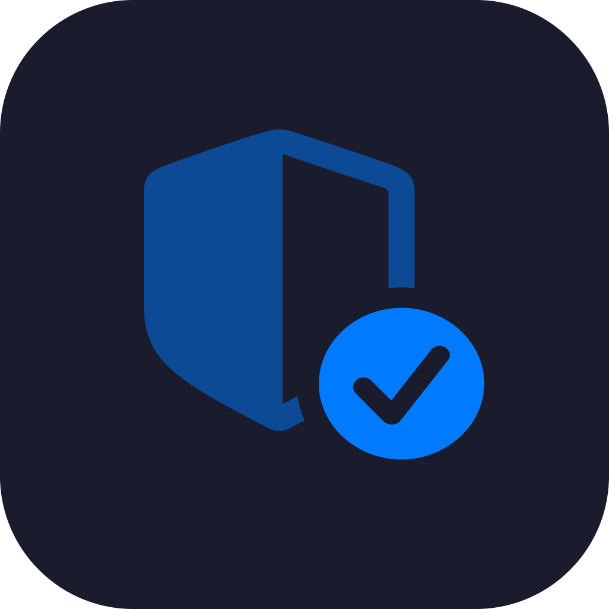
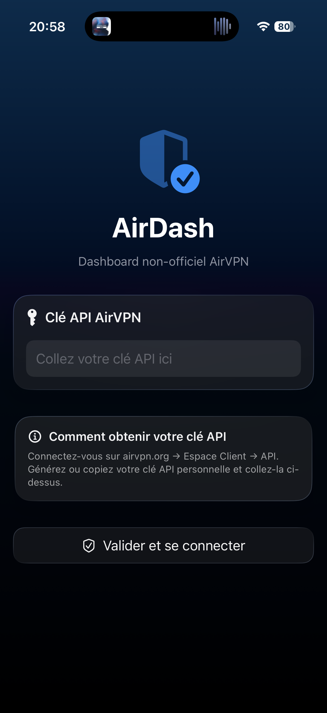
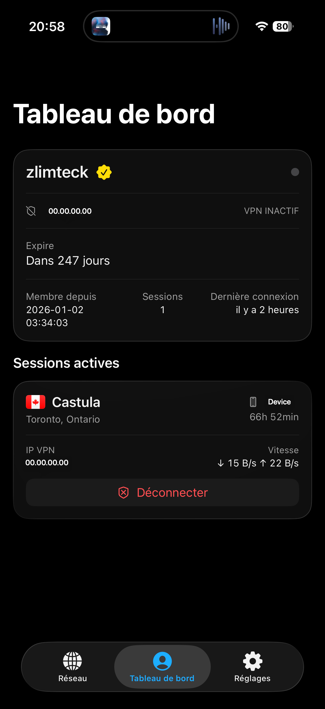
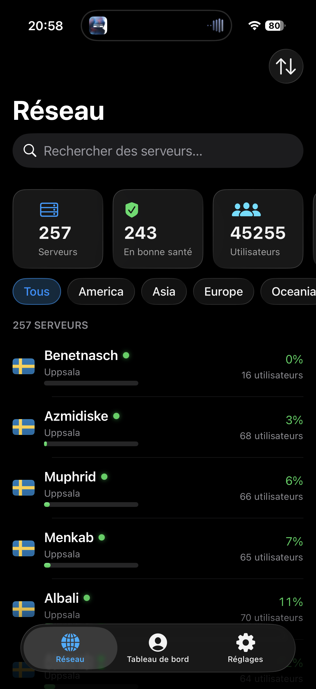
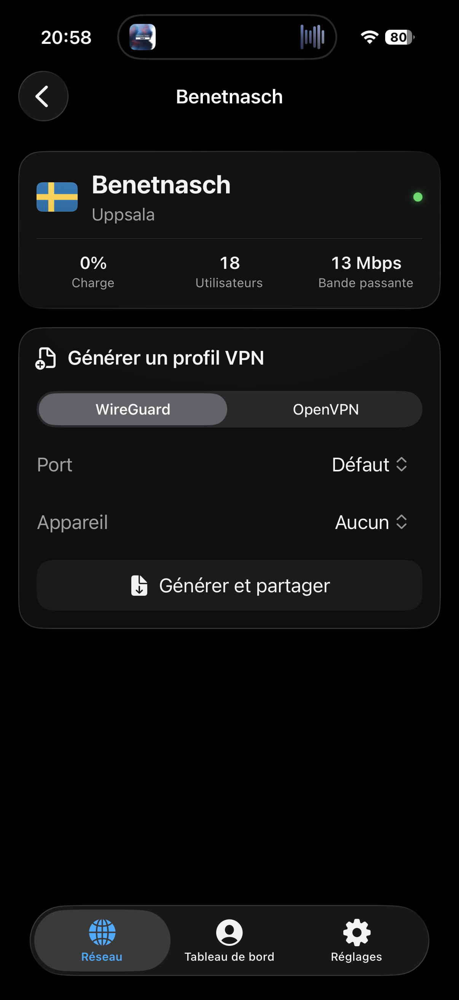

# AirDash iOS



[](https://github.com/zlimteck/AirDash-iOS/actions/workflows/build.yml)

Unofficial native iOS dashboard for [AirVPN](https://airvpn.org), built with SwiftUI and the iOS 26 Liquid Glass design.

> ⭐ If you find this project useful, a star on GitHub is greatly appreciated!

> **Disclaimer** — This is an independent project with no affiliation to AirVPN. It uses the public AirVPN API with your personal API key.

---

## Screenshots

<p float="left">
  
  
  
  
</p>

---

## Features

- **Network** — full server list with load, connected users, health status, sort, continent filter and search
- **Dashboard** — account info (current IP, device VPN status, expiration, credits, sessions, member since, last seen), session disconnect
- **Server detail** — WireGuard or OpenVPN profile generation, direct import into the system VPN app, file sharing
- **Settings** — API key rotation, light/dark/system theme
- **Widget** — current IP, VPN status and active sessions directly on the home screen (Small and Medium sizes)
- **Quick Actions** — long-press the app icon to jump directly to Dashboard or Network

---

## Tech Stack

| | |
|---|---|
| Language | Swift 6 |
| UI | SwiftUI + iOS 26 Liquid Glass |
| Architecture | MVVM (`@MainActor` + `ObservableObject`) |
| Networking | `actor AirVPNAPIClient` with TTL cache |
| Security | API key stored in Keychain |
| Localisation | String Catalog (FR / EN) |
| Build | XcodeGen (`project.yml`) |
| Dependencies | [FlagKit](https://github.com/madebybowtie/FlagKit) |

---

## Requirements

- Xcode 26 beta or later
- iOS 26 minimum (simulator or device)
- [XcodeGen](https://github.com/yonaskolb/XcodeGen) installed
- An AirVPN API key (account → *Client Area* → *API*)

---

## Installation & Build

### 1. Install XcodeGen

```bash
brew install xcodegen
```

### 2. Clone and generate the project

The `.xcodeproj` is not versioned — generate it after cloning:

```bash
git clone https://github.com/zlimteck/airdash-ios.git
cd AirDash-iOS
xcodegen generate
open AirDash.xcodeproj
```

### 3. Resolve dependencies

Xcode downloads **FlagKit** automatically on first launch. If not:

**File → Packages → Resolve Package Versions**

### 4. Signing

- **Simulator** — no configuration needed, just hit **⌘R**
- **Real device** — Xcode → targets `AirDash` and `AirDashWidget` → *Signing & Capabilities* → select the same Apple team on both

> The widget and the app share an **App Group** (`group.com.airdash.ios`). Both targets must be signed with the same team for the group to work on a real device.

### Note

After adding any `.swift` file outside of Xcode, run `xcodegen generate` before building.

---

## Project Structure

```
AirDash-iOS/
├── AirDash/
│   ├── App/                  # Entry point, AppState, AppDelegate, MainTabView
│   ├── Models/               # AirVPNModels, AppError
│   ├── Networking/           # AirVPNAPIClient (actor), CacheService
│   ├── Services/             # KeychainService, VPNProfileImporter, SharedDataService
│   ├── ViewModels/           # DashboardViewModel, NetworkStatusViewModel, …
│   ├── Views/
│   │   ├── Components/       # GlassCard, GlassButton, FlagBadge, LoadBar, …
│   │   ├── Dashboard/        # DashboardView, SessionRowView
│   │   ├── NetworkStatus/    # NetworkStatusView, ServerRowView
│   │   ├── Onboarding/       # OnboardingView
│   │   ├── ServerDetail/     # ServerDetailView
│   │   └── Settings/         # SettingsView
│   └── Resources/            # Localizable.xcstrings, Assets.xcassets
└── AirDashWidget/            # Widget Extension (WidgetKit)
    └── AirDashWidget.swift   # Provider, entry, Small/Medium views
```

### Shared data (App Group)

The app and the widget communicate via `UserDefaults(suiteName: "group.com.airdash.ios")`. After each Dashboard load, `SharedDataService` writes the data and automatically reloads the widget.

---

## AirVPN API

The app exclusively uses the public AirVPN API:

| Endpoint | Usage |
|---|---|
| `POST /api/status/` | Server list and network stats |
| `POST /api/userinfo/` | Account info and active sessions |
| `POST /api/disconnect/` | Disconnect a VPN session |
| `POST /api/devices/` | Device management |
| `GET /api/generator/` | WireGuard / OpenVPN profile generation |

---

## Known Limitations

- Disconnecting a session via the app does not kill the active VPN tunnel on the device (this would require the *Personal VPN* entitlement and `NETunnelProviderManager`, which require a paid developer account)
- Compatible with iPhone and iPad

---

## License

MIT
